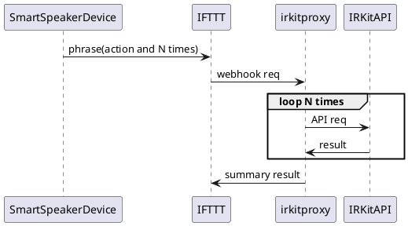

# irkit-proxy

- [irkit-proxy](#irkit-proxy)
  - [Setup](#setup)
    - [Generate IRKit request payload](#generate-irkit-request-payload)
    - [Env setting](#env-setting)
    - [mapping setting](#mapping-setting)
    - [IFTTT Action Setting](#ifttt-action-setting)
      - [IF](#if)
      - [THEN](#then)
  - [Run](#run)
    - [proxy example](#proxy-example)
  - [Manual Request](#manual-request)

:loud_sound: Simple API tool as IRKit proxy. [IRKit](https://getirkit.com/) is a IoT device as remote controller,
and [IFTTT](https://ifttt.com/) is a trigger and action service with IoT device.

This proxy addresses following problems:

- IRKit api does not support tlsv1.2, and IFTTT webhook now only supports tlsv1.2 and above.
So by for now, IFTTT cannot send request to IRkit apis.
- IFTTT free plan has became define only 3 custom actions.
- IFTTT trigger cannot request multiple times all at once.

IFTTT action is like below:

<!---

-->


`Google Assistant` has ingredient util on IFTTT (speaking phrase can be used on next webhook),
so `GoogleHome` is especially suitable.

## Setup

### Generate IRKit request payload

See details: <https://getirkit.com/>

### Env setting

This api is restricted by `apikey` on request body, so you should deploy on tls.

Set `APIKEY` with any random value on `.env`.

```:sh
# mandatory
APIKEY=xxxx

# option
LOG_LEVEL=info (defult: `warn`)
PORT=9999 (default: `8000`)
CONF_PATH=/path/to/conf (default: `./mappings.json`)

# option (for use standalone ssl.)
USETLS=true
KEY_PATH=./server.key
CERT_PATH=./server.cert
PORT=443
TIME_ZONE=Asia/Tokyo
```

### mapping setting

We should define mappings for `phrase` and `IRkit request payload`.

Set `mappings.json` like below:

```:json
{
  "rules": [
    {
      "id": "turn-light",
      "words": [
        "照明",
        "つけて"
      ],
      "payload": "clientkey=xxxx&deviceid=xxxx&message={\"format\":\"raw\",\"freq\":38,\"data\":[20691,10398,...]}"
    },
    {
      "id": "turn-up",
      "words": [
        "照明",
        "明るく"
      ],
      "payload": "test1"
    },
    {
      "id": "turn-down",
      "words": [
        "照明",
        "暗く"
      ],
      "payload": "test2"
    }
  ],
  "schedules": [
    {
      "cronTime": "0 0 0 * * *",
      "timezone": "Asia/Tokyo",
      "ruleId": "turn-light",
      "repeat": 1
    }
  ]
}

```

In `rules` section, if all `words` are contained in request `phrase`, its correspond `payload` will be use.

In `schedules` section, you can define schedules for rules correspond to `ruleId`. This section is Optional.

### IFTTT Action Setting

#### IF

Use `Say a phrase with both a number and a text ingredient` on `Google Assistant`.

Set params for `What do you want to say?` like below:

`IR $ for # times (IR $ を # 回)`

Then, if you speak `ok google, IR Room light 3 times`, `Room light` is set to `$`
and `3` is set to `#`.

These params can be used in next then-action by using ingredient.

#### THEN

Use `Make a web request` on `webhook`.

Set params like below:

```:sh
URL: https://<your apihost>/v1/api/irkit
Method: POST
Content-type: application/json
Body: {"apikey": "<your defined value>", "phrase": " {{TextField}}", "repeat": {{NumberField}} }
```

`{{TextField}}` and `{{NumberField}}` are corresponded to `Room light` and `3` respectively on above example.

## Run

```:sh
# local
$ npm run serve

################################ 

# docker usecase
$ docker build -t irkit-proxy .

## proxy case
$ docker run -d -p 127.0.0.1:8000:8000 --restart always irkit-proxy

## standalone case (set env USETLS=true)
$ docker run -d -p 443:443 --restart always irkit-proxy
```

### proxy example

nginx(openresty) settings:

```:sh
server {
    listen 443 ssl;
    server_name api.nicopun.com;

    # fallback certs, make sure to create them before hand
    ssl_certificate /etc/openresty/default.pem;
    ssl_certificate_key /etc/openresty/default.key;

    ssl_certificate_by_lua_block {
        require("resty.acme.autossl").ssl_certificate()
    }

    location / {
        proxy_pass http://127.0.0.1:8000;
    }
}
```

## Manual Request

```:sh
ᐅ curl -XPOST -H 'content-type: application/json' \
    -d '{"apikey": "xxxx", "phrase": "照明 を 明るく して", "repeat": 2}' \
    https://api.nicopun.com/v1/api/irkit
```
